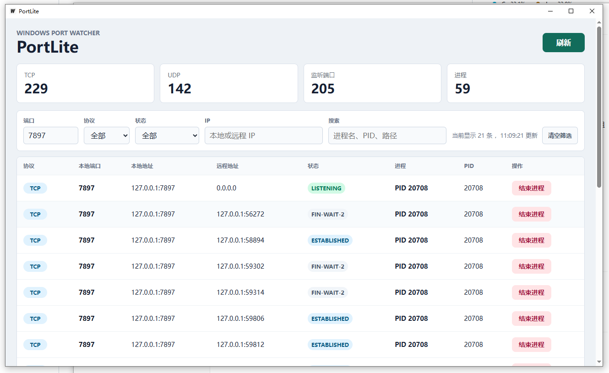

# PortLite

PortLite 是一个用 Wails v3 写的 Windows 本地端口查看器。

它的目标很简单：当本地服务启动失败、提示端口被占用时，不用再来回敲 `netstat`、`findstr`、`tasklist`，直接打开一个小窗口看清楚端口被哪个进程占了。

基于 [fengfengzhidao/port_lite](https://github.com/fengfengzhidao/port_lite) 二开，增加了多项实用功能。

## 功能

- 查看本机 TCP / UDP 端口。
- 显示本地地址、远程地址、TCP 状态、PID、进程名和进程路径。
- **端口精确过滤** — 输入端口号快速定位。
- **IP 地址过滤** — 按本地或远程 IP 地址筛选。
- **协议筛选** — 按 TCP / UDP 过滤。
- **状态筛选** — 按 LISTENING / ESTABLISHED / TIME-WAIT / CLOSE-WAIT 过滤，自动与协议联动，排除无效组合。
- **状态颜色标记** — LISTENING(绿)、ESTABLISHED(蓝)、TIME-WAIT(黄)、CLOSE-WAIT(红)，一目了然。
- **模糊搜索** — 支持按进程名、PID、路径等全字段搜索。
- **一键清空筛选** — 有筛选条件时显示「清空筛选」按钮。
- 支持手动刷新端口列表。
- 支持确认后结束占用端口的进程。

截图


## 直接使用

从 [Releases](https://github.com/CycSpring/OpManager/releases) 下载 `PortLite.exe`，双击即可运行。

仅需 Windows 10 (1803+) 或 Windows 11（自带 WebView2 Runtime）。

## 安全说明

PortLite 里的"结束进程"不是关闭某一个端口，而是结束占用这个端口的进程。

项目里做了几个基础保护：

- 不允许结束 PID `0`。
- 不允许结束 PID `4`。
- 不允许结束 PortLite 自己的进程。
- 每次结束进程前都会弹出确认框。

有些系统进程或管理员权限进程即使点了结束，也可能因为权限不足而失败，这是正常情况。

## 从源码构建

### 环境要求

- Windows 10 / Windows 11
- Go 1.25 或更新版本
- Node.js 24 或更新版本
- npm 11 或更新版本
- Wails v3 CLI

### 本地运行

```powershell
git clone git@github.com:CycSpring/OpManager.git
cd OpManager/port_lite

cd frontend
npm install
cd ..

wails3 dev
```

### 打包

```powershell
wails3 task build
```

产物在 `bin/PortLite.exe`，约 8.9 MB。

### 测试

```powershell
cd frontend
npm install
npm run build
cd ..

go test ./...
```

## 项目结构

```text
.
├── main.go                    # Wails 应用入口
├── portservice_windows.go      # Windows 端口和进程查询逻辑
├── portservice_other.go        # 非 Windows 平台占位实现
├── portservice_windows_test.go # Windows 端口解析相关测试
├── frontend                    # Vue 前端
├── build                       # Wails 构建配置
└── Taskfile.yml                # Wails 任务入口
```

## 致谢

原项目：[fengfengzhidao/port_lite](https://github.com/fengfengzhidao/port_lite)
